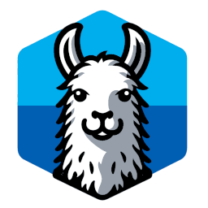

## ManagedLlama2



Llama2 inference for 4-bit AWQ quantized models with C# and [ManagedCuda](https://github.com/kunzmi/managedCuda)

Based on [llama2.c](https://github.com/karpathy/llama2.c) and [llama_cu_awq](https://github.com/ankan-ban/llama_cu_awq)

## Build

#### Install dependencies
```
sudo apt -y install dotnet-sdk-8.0 nvidia-cuda-toolkit cmake
```
#### Build from source
```
git clone https://github.com/GilesBathgate/ManagedLlama2
cd ManagedLlama2
./build.sh
```

## Setup

Easily download and convert the model

```
cd examples/Setup
dotnet run ../model.bin ../tokenizer.bin
cd -
```

> **Note:** This will download and convert a pre-quantized Llama2-13b model. For instructions on how to quantize your own Llama2-based models, please see the "Quantization" section below.

## Run

Launch a simple web based chat client

```
cd examples/WebSocket
dotnet run ../model.bin ../tokenizer.bin
```

## Quantization

To generate AWQ INT4 quantized weights use [llm-awq](https://github.com/mit-han-lab/llm-awq). The llm-awq project now uses a v2 weight packing scheme so we need to restore the code to v1

* Clone repo
```sh
cd ~
git clone https://github.com/mit-han-lab/llm-awq.git
cd llm-awq
```
* Add v2 format tag
```sh
git tag format-v2 5f06dbbed109f05b4a8e50556fbcf5115652ed85
```
* Restore to pre v2
```sh
git restore --source=format-v2^ awq/quantize/qmodule.py
git restore --source=format-v2^ awq/entry.py
```
* Create environment
```sh
virtualenv .env --prompt=awq
ln .env/bin/activate
. activate
pip install --upgrade pip
pip install -e .
```
* Build kernels
```sh
cd awq/kernels
python setup.py install
cd -
```
* Download original llama2 model files (needs huggingface token)
```sh
export hf_token=<token_goes_here>
```
```sh
mkdir -p models/llama2-hf/llama-2-7b-chat
cd models/llama2-hf/llama-2-7b-chat

wget --header="Authorization: Bearer $hf_token" https://huggingface.co/meta-llama/Llama-2-7b-chat-hf/resolve/main/pytorch_model-00001-of-00002.bin?download=true -O pytorch_model-00001-of-00002.bin

wget --header="Authorization: Bearer $hf_token" https://huggingface.co/meta-llama/Llama-2-7b-chat-hf/resolve/main/pytorch_model-00002-of-00002.bin?download=true -O pytorch_model-00002-of-00002.bin

wget --header="Authorization: Bearer $hf_token" https://huggingface.co/meta-llama/Llama-2-7b-chat-hf/resolve/main/pytorch_model.bin.index.json?download=true -O pytorch_model.bin.index.json

wget --header="Authorization: Bearer $hf_token" https://huggingface.co/meta-llama/Llama-2-7b-chat-hf/resolve/main/config.json?download=true -O config.json

wget --header="Authorization: Bearer $hf_token" https://huggingface.co/meta-llama/Llama-2-7b-chat-hf/resolve/main/tokenizer.model?download=true -O tokenizer.model

cd -

```
* Download **OR** Generate quantization meta-data
```sh
mkdir awq_cache
cd awq_cache
wget https://huggingface.co/datasets/mit-han-lab/awq-model-zoo/resolve/main/llama-2-7b-chat-w4-g128.pt?download=true -O llama-2-7b-chat-w4-g128.pt
cd -
```
```sh
mkdir awq_cache
python -m awq.entry --model_path models/llama2-hf/llama-2-7b-chat --w_bit 4 --q_group_size 128 --run_awq --dump_awq awq_cache/llama-2-7b-chat-w4-g128.pt
```
* Generate quantized model
```sh
python -m awq.entry --model_path models/llama2-hf/llama-2-7b-chat --w_bit 4 --q_group_size 128 --load_awq awq_cache/llama-2-7b-chat-w4-g128.pt --q_backend real --dump_quant quant_cache/llama-2-7b-chat-w4-g128-awq.pt

```
* Pack the quantized model for managedLlama2
```sh
cd ~/ManagedLlama2/examples/Pack
dotnet run ~/llm-awq/models/llama2-hf/llama-2-7b-chat/config.json ~/llm-awq/quant_cache/llama-2-7b-chat-w4-g128-awq.pt ~/llm-awq/models/llama2-hf/llama-2-7b-chat/tokenizer.model ../model.bin ../tokenizer.bin
```

## License

MIT / GPLv3